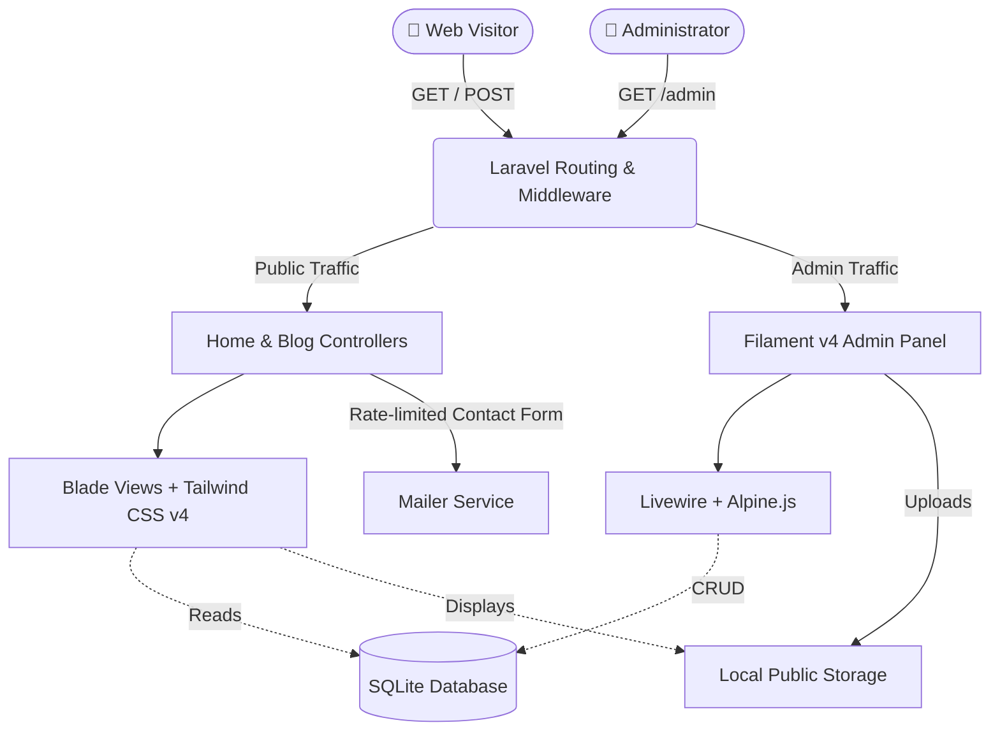
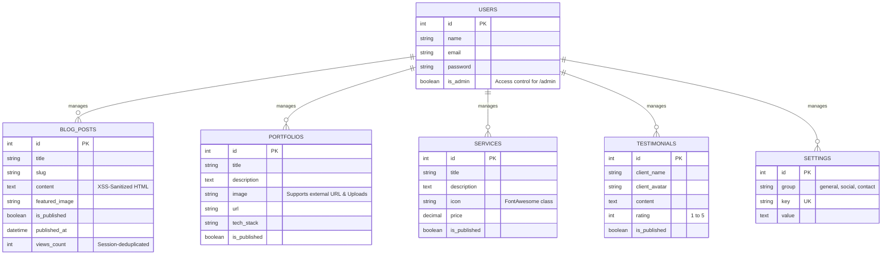

# KANG WILLY - Personal Branding Website

A modern, high-performance personal branding and portfolio website built with the TALL stack.


---

## 🏗️ System Architecture



## 🗄️ Database Schema



---

## ✨ Key Features

- **Blazing Fast Frontend:** Server-side rendered Blade views styled with Vite + Tailwind CSS v4.
- **Dynamic CMS Panel:** Fully featured admin dashboard powered by Filament v4.
- **Security First:** 
  - Stored XSS protection via `Symfony/HtmlSanitizer` for rich text content.
  - Strict scope guards preventing draft leakage.
  - Rate-limited (`throttle:5,1`) contact form.
- **SEO & Accessibility Ready:** 
  - Dynamic `sitemap.xml` and `robots.txt`.
  - OpenGraph & Twitter meta tags auto-injected.
  - ARIA attributes and screen-reader compliant (a11y).
- **Global Dynamic Settings:** Site identity, emails, and social links are fully manageable from the admin panel (cached forever, auto-invalidated on update).

## 🚀 Installation & Setup

1. **Clone & Install Dependencies**
   ```bash
   composer install
   npm install
   ```

2. **Environment Setup**
   ```bash
   cp .env.example .env
   php artisan key:generate
   ```

3. **Database & Storage**
   ```bash
   touch database/database.sqlite
   php artisan migrate:fresh --seed
   php artisan storage:link
   ```

4. **Build Frontend Assets**
   ```bash
   npm run build
   ```

5. **Serve**
   ```bash
   php artisan serve
   ```

## 🧪 Testing

The application includes a comprehensive test suite (Unit & Feature tests) covering public pages, SEO routes, authorization, and contact form behavior.

```bash
php artisan test
```
